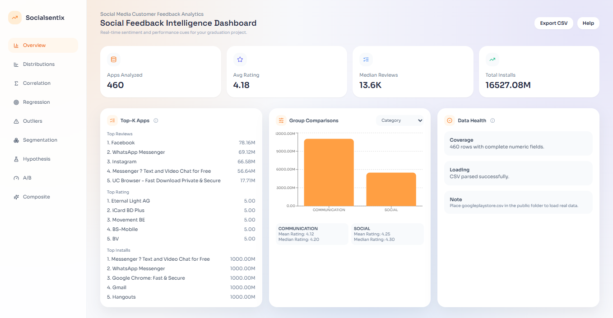
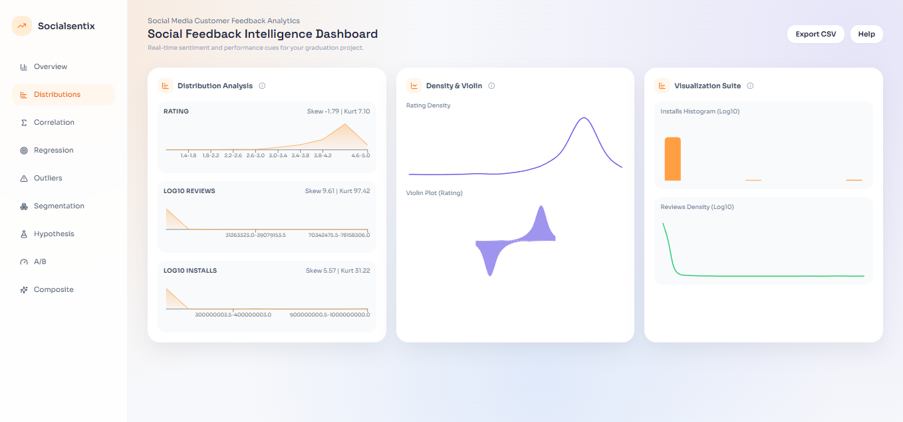
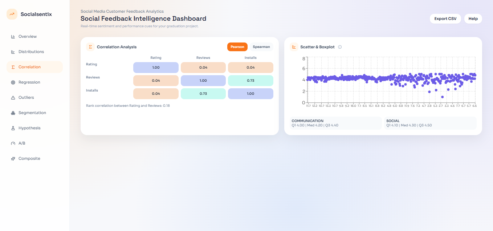
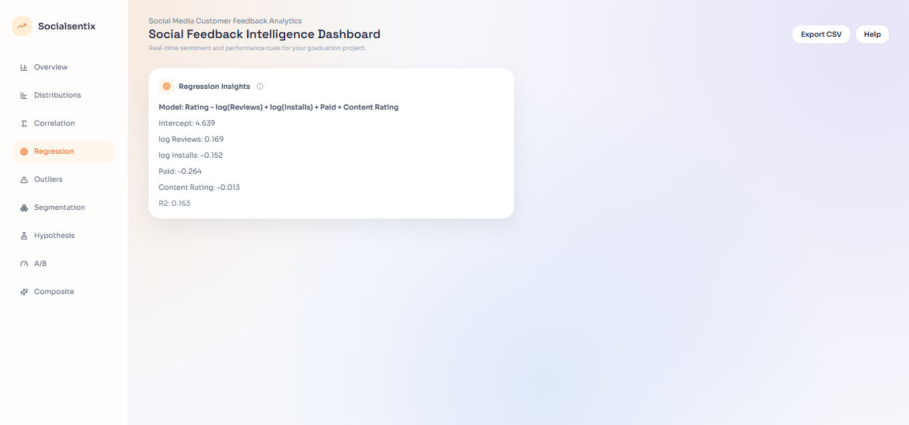
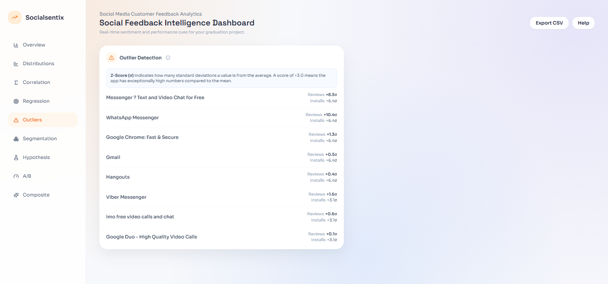
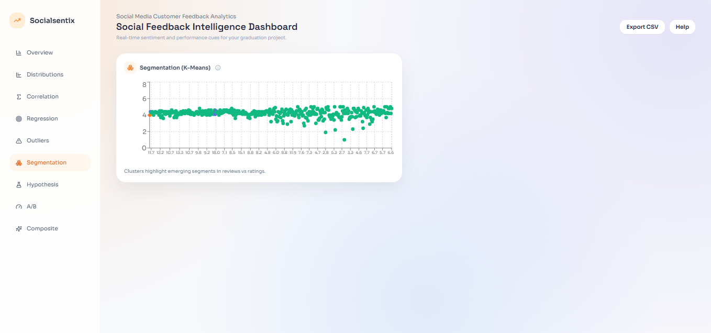
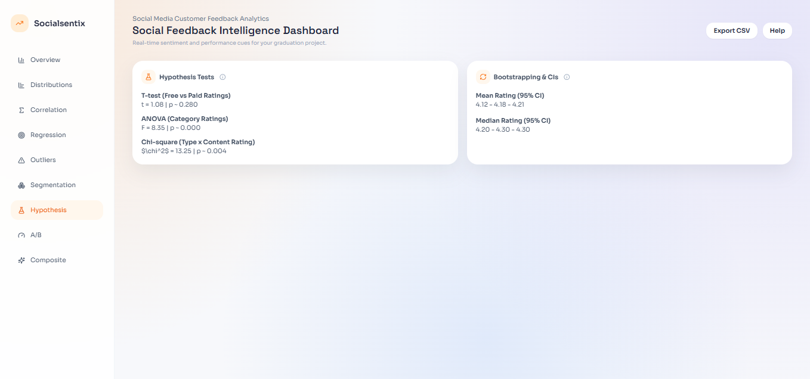
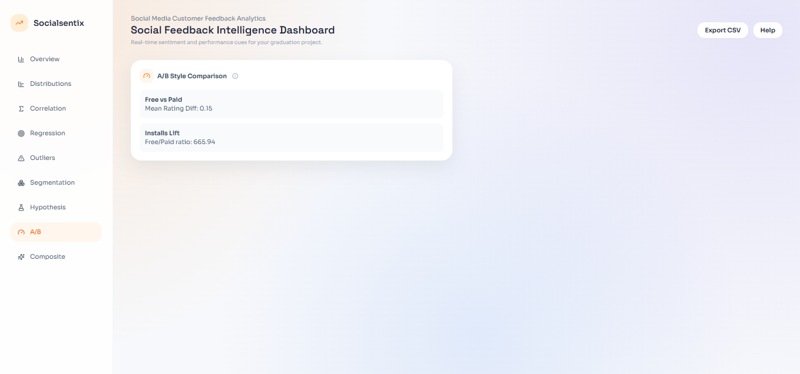
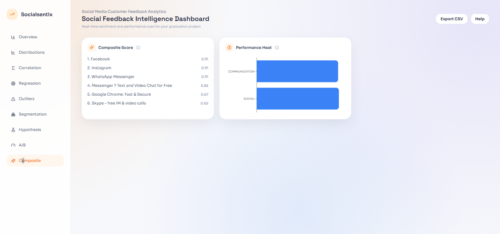

# Google Play Store Analytics Dashboard

An interactive data visualization and analytics dashboard built with React, Vite, Tailwind CSS, and Recharts. This application processes and visualizes the Google Play Store dataset to extract meaningful insights about app ratings, reviews, installations, and categories.

## Screenshots

<div align="center">
  
  
  
  <br/>
  
  
  
  <br/>
  
  
  
</div>

## Features

- **Overview**: High-level metrics and KPIs of the app ecosystem.
- **Distributions**: Visual layout of app ratings, reviews, and categories.
- **Correlation**: Scatter plots showing relationships (e.g., Reviews vs. Installs).
- **Regression**: Trendlines modeling app performance.
- **Outliers**: Detection and highlighting of anomalous apps.
- **Segmentation**: Categorizing apps by content rating and type (Free vs. Paid).
- **Hypothesis**: Visualizations for statistical hypothesis testing.
- **A/B**: Performance comparison models.
- **Composite**: Multi-metric analysis and tailored insights.

## Tech Stack

- **Framework**: [React 18](https://reactjs.org/) + [Vite](https://vitejs.dev/)
- **Styling**: [Tailwind CSS](https://tailwindcss.com/)
- **Visualizations**: [Recharts](https://recharts.org/)
- **Icons**: [Lucide React](https://lucide.dev/)

## Project Structure

```text
├── public/
│   └── googleplaystore.csv  # The dataset loaded by the app
├── src/
│   ├── App.jsx              # Main dashboard component and logic
│   ├── index.css            # Global styles and Tailwind imports
│   └── main.jsx             # Application entry point
├── package.json             # NPM dependencies and scripts
├── tailwind.config.js       # Tailwind CSS configuration
└── vite.config.js           # Vite bundle configuration
```

## Prerequisites

Before you begin, ensure you have the following installed on your machine:
- [Node.js](https://nodejs.org/) (v16.0 or higher recommended)
- [npm](https://www.npmjs.com/) (usually installed automatically with Node.js)

## Getting Started

Follow these steps to run the project locally.

1. **Clone the repository** (or download the files):
   ```bash
   # git clone <your-repo-url>
   # cd <your-project-directory>
   ```

2. **Install dependencies**:
   ```bash
   npm install
   ```

3. **Start the development server**:
   ```bash
   npm run dev
   ```
   The app will run at `http://localhost:5173`. 

## Build for Production

To compile an optimized build for deployment (e.g., to GitHub Pages, Vercel, or Netlify):
```bash
npm run build
```
This will generate a `dist` folder containing the production-ready static files.

## Dataset Information

The application fetches `googleplaystore.csv` from the `public/` directory at runtime. If the dataset is present, it will compute analytics over the real app store data. If it is missing or fails to load, the dashboard will gracefully fall back to a small set of mock data to demonstrate functionality.

## How to use (for non-technical users)

- **Open the app**: Run `npm install` then `npm run dev` and open `http://localhost:5173` in your browser.
- **Load your data**: Drop your `googleplaystore.csv` file into the `public/` folder and reload the page. The app automatically reads the CSV on load.
- **Navigation**: Use the left menu to switch between dashboard sections (Overview, Distributions, Correlation, Regression, Outliers, Segmentation, Hypothesis, A/B, Composite).
- **Export**: Click the *Export CSV* button in the top-right to download the currently loaded dataset.
- **Quick help**: Click the *Help* button in the top-right of the app for a plain-language explanation of what each section means.

## What the sections mean (plain language)

- **Overview** — High-level metrics: how many apps were analyzed, typical rating, median reviews, and total installs.
- **Distributions** — Shows how ratings, reviews, and installs are spread across apps (histograms, density plots, violin plots).
- **Correlation** — Shows whether two metrics move together (for example: do more reviews mean higher ratings?). You can pick Pearson or Spearman correlation.
- **Regression** — A simple statistical model estimating how reviews, installs, paid/free status, and content rating predict average rating.
- **Outliers** — Apps that look unusual compared to the rest (very high reviews or installs, or an odd rating pattern).
- **Segmentation** — Groups apps into clusters (similar behavior) so you can spot segments like 'high installs, low rating'.
- **Hypothesis** — Basic statistical tests (t-test, ANOVA, chi-square) to check if differences between groups are likely real.
- **A/B** — Simple comparisons between groups (e.g., Free vs Paid apps) to surface typical differences.
- **Composite** — Combines several metrics into a single score to rank apps on overall performance.

## CSV columns explained (what each header should contain)

- `App` — The app name (string).
- `Category` — App category (e.g., GAME, SOCIAL, PRODUCTIVITY).
- `Rating` — Average rating, numeric (1.0 - 5.0).
- `Reviews` — Number of reviews (integer). Commas or plus signs are removed automatically.
- `Installs` — Number of installs (integer). Commas or plus signs are removed automatically.
- `Type` — `Free` or `Paid`.
- `Content Rating` — Age rating (Everyone, Teen, Mature 17+, etc.).

If column names differ, rename them in your CSV to match the above headers so the dashboard can read them correctly.

## Quick troubleshooting

- If the dashboard shows only a few rows or mock data, confirm `googleplaystore.csv` exists in the `public/` folder and that the file contains the expected headers.
- If charts are empty, check that numeric columns (`Rating`, `Reviews`, `Installs`) are numeric and don't contain text or stray characters.

---

If you'd like, I can also add inline tooltips for specific controls or create a printed-exportable one-page guide inside the app. Want me to add that next?
